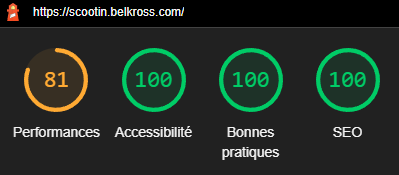

# Scootin

A showcase website thought for a fictitious scooter rental company.

No code website builders don’t allow a full customization experience. With this project, I tried the Jamstack architecture to provide to non-developers a way to add content to their website whithout
loosing any customization freedom.

Don’t judge the code quality, it’s an old junior project so it is pretty messy. At least, the result answer to the constraints I fixed to myself.

Live version here : [scootin.belkross.com](https://scootin.belkross.com/)

## Features

- 100% of the content is connected to a CMS and easily editable by non-developers
- Multilingual pages
- Responsive design, dark/light mode
- Accessibility and SEO

Lighthouse results:

## Built with

- [React](https://reactjs.org/) - user interface Javascript library
- [Gatsby](https://www.gatsbyjs.com/) - React-based framework to build static sites
- [DatoCMS](https://www.datocms.com/) - content management system (CMS)
- [GraphQL](https://graphql.org/) - data query language
- [Mui](https://mui.com/) - components and styling React library
- [Framer Motion](https://www.framer.com/motion/) - React library for animations
- [Frontend Mentor](https://www.frontendmentor.io/home) - design and assets
- [Netlify](https://www.netlify.com/) - hosting
